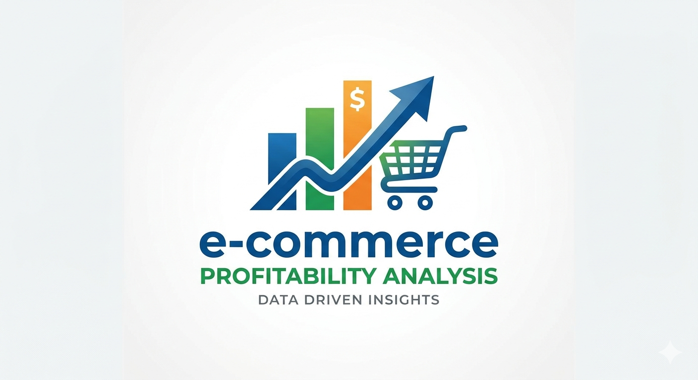

# E-Commerce Profitability Analysis

  

> Analyzing profitability across product categories, sales channels, return rates, and marketing platforms — for a multi-channel e-commerce operation between 2024 and 2025.

---

## 1. Project Background

BrightCart is an online retailer selling products across 8 categories through their website, mobile app, third-party marketplaces, and social commerce. The company did $1M+ in gross revenue over the past two years, but net margins have been shrinking. This analysis describes which product categories and sales channels are truly profitable after all costs, which marketing platforms are delivering the best return on ad spend, and whether the return rate is eating into margins.

This project uses SQL for all data cleaning, validation, and analysis across three source tables: orders, products, and marketing spend.

As a fresher data analyst, I chose this dataset because profitability analysis — combining revenue, cost, return rates, and ROAS — reflects real decision-making at e-commerce companies, and requires joining multiple tables with business logic applied at each step.

---

## 2. Data Structure & Initial Checks

**Tables:** `orders` · `products` · `marketing_spend`
**Total Orders:** 2,000 | **Gross Revenue:** $277,900
**Each row in orders:** One customer order record

---

<b>Column Reference — orders</b>

 

| Column | Data Type | Description |
|--------|-----------|-------------|
| `order_id` | VARCHAR | Unique order identifier (primary key) |
| `product_id` | VARCHAR | Foreign key linking to products table |
| `channel` | VARCHAR | Sales channel — Mobile App / Website / Social Commerce / Marketplace |
| `payment_method` | VARCHAR | Payment method used by customer |
| `region` | VARCHAR | Geographic region of order |
| `gross_revenue` | NUMERIC | Revenue before discounts |
| `discount_amount` | NUMERIC | Discount applied to order |
| `net_revenue` | NUMERIC | Revenue after discount |
| `product_cost` | NUMERIC | Cost of goods sold |
| `shipping_cost` | NUMERIC | Shipping cost per order |
| `platform_fee` | NUMERIC | Fee charged by sales channel |
| `transaction_fee` | NUMERIC | Payment processing fee |
| `total_costs` | NUMERIC | Sum of all cost components |
| `profit` | NUMERIC | Net revenue minus total costs |
| `is_returned` | BOOLEAN | Whether the order was returned |
| `order_date` | DATE | Date the order was placed |

---

<b>Column Reference — products</b>

 

| Column | Data Type | Description |
|--------|-----------|-------------|
| `product_id` | VARCHAR | Unique product identifier (primary key) |
| `category` | VARCHAR | Product category — Electronics / Toys / Home & Kitchen / Food & Beverage / Sports / Clothing / Beauty / Books |
| `product_name` | VARCHAR | Name of the product |
| `base_price` | NUMERIC | Standard selling price |

---

<b>Column Reference — marketing_spend</b>

 

| Column | Data Type | Description |
|--------|-----------|-------------|
| `month` | VARCHAR | Month of spend (composite key part 1) |
| `platform` | VARCHAR | Marketing platform — TikTok / Influencer / Instagram / Google / Facebook / Email (composite key part 2) |
| `spend` | NUMERIC | Total spend for that platform in that month |
| `attributed_revenue` | NUMERIC | Revenue attributed to the platform |
| `orders_attributed` | INTEGER | Orders attributed to the platform |

---

<b>Initial Checks Performed</b>

 

- Verified no duplicate `order_id` values in orders or `product_id` values in products
- Validated composite primary key `(month, platform)` in marketing_spend for uniqueness
- Checked NULL values across all key identifier columns
- Reconciled cost components: `product_cost + shipping_cost + platform_fee + transaction_fee = total_costs`
- Checked for negative values in revenue, cost, and profit columns
- Confirmed discount amounts never exceed gross revenue
- Ran distinct value audits on channel, payment_method, and region for consistency

> ✅ **Result:** No data quality issues found. All cost components reconcile correctly. Zero duplicate keys or NULL identifiers detected.

---

## 3. Problem Statement

The business is generating $277,900 in gross revenue across 2,000 orders — but with an average profit margin of only 20.3%, understanding exactly where margin is being lost is critical.

Marketing spend of $503,506 is spread across 6 platforms with widely varying returns. Some channels are generating 24x ROAS while others barely break 5x. Some product categories are delivering 31% margins while others struggle to reach 12%.

This analysis was built to answer:

- Which product categories are most and least profitable — and why?
- Which sales channels generate the highest profit per order?
- Where are return rates highest, and how much revenue is being lost?
- Which marketing platforms deliver the best and worst ROAS?
- Where should the marketing budget be cut to save 20% with minimal revenue impact?

---

## 4. Key Insights

| # | Insight | Finding |
|---|---------|---------|
| 1 | **Electronics leads all categories at 31.1% margin** | High average selling price absorbs fixed shipping costs effectively |
| 2 | **Books is the worst-performing category at 11.9% margin** | High return rate + high shipping cost on low-value items is the primary drag |
| 3 | **Mobile App is the most profitable sales channel** | $36.32 profit per order and 29.8% margin — zero platform fees |
| 4 | **Marketplace platform fees destroy margin** | $18.97 average fee per order reduces profit/order to just $15.40 |
| 5 | **TikTok Ads delivers best ROAS at 24.4x** | Generates $24 per $1 spent, yet only uses 11.4% of total budget |
| 6 | **Email Marketing is the biggest budget waste** | 5.4x ROAS and $26 CPA — over 6x more expensive per conversion than TikTok |

---

## 5. Insight Deep Dive

> Click each insight to expand the full analysis

---

<b>Insight 1 — Electronics Leads at 31.1% Margin; Books Trails at 11.9%</b>

 

**Category Profitability Summary (Q1)**

| Category | Net Revenue | Total Profit | Margin % | Avg Shipping | Return Rate |
|----------|-------------|--------------|----------|--------------|-------------|
| Electronics | $44,886 | $13,973 | 31.1% | $26.74 | 8.61% |
| Toys | $33,596 | $8,786 | 26.2% | $26.23 | 7.00% |
| Home & Kitchen | $26,360 | $6,689 | 25.4% | $24.94 | 6.00% |
| Food & Beverage | $30,663 | $7,592 | 24.8% | $26.08 | 5.67% |
| Sports | $32,330 | $7,597 | 23.5% | $23.68 | 7.19% |
| Clothing | $31,383 | $6,272 | 20.0% | $25.41 | 8.19% |
| Beauty | $18,254 | $3,175 | 17.4% | $25.23 | 5.85% |
| Books | $18,847 | $2,250 | 11.9% | $26.20 | 8.37% |

Electronics benefits from high average selling prices that absorb fixed shipping costs — the same $26 shipping fee represents a much smaller fraction of a $150 electronics order than a $15 book.

Books suffer from the compounding effect of high shipping costs, high return rates (8.4%), and low selling prices. Beauty faces a similar structural issue — high per-order shipping cost relative to item value.

> **Key Takeaway:** To improve Books and Beauty margins, shipping rate negotiation or minimum order thresholds are more impactful than product cost reduction alone.

---

<b>Insight 2 — Mobile App Generates 2.4x the Profit Per Order of Marketplace</b>

 

**Channel Profitability Summary (Q2)**

| Channel | Orders | Net Revenue | Total Profit | Profit/Order | Margin % |
|---------|--------|-------------|--------------|--------------|----------|
| Mobile App | 589 | $71,893 | $21,393 | $36.32 | 29.8% |
| Website | 795 | $92,991 | $25,118 | $31.60 | 27.0% |
| Social Commerce | 197 | $21,929 | $3,371 | $17.11 | 15.4% |
| Marketplace | 419 | $49,505 | $6,452 | $15.40 | 13.0% |

The Mobile App's advantage is structural — it charges zero platform fees, meaning every dollar of net revenue flows through to profit at a higher rate. Marketplace's $18.97 average platform fee per order directly erodes margin, pushing profit per order down to $15.40.

Social Commerce sits in the middle at $17.11 profit per order, weighed down by $9.87 average platform fees per order.

> **Key Takeaway:** Marketplace and Social Commerce platform fees consume 13–15% of margin. Negotiating fee caps or redirecting acquisition spend to owned channels (Website and App) would directly lift profitability.

---

<b>Insight 3 — $20,582 Lost to Returns; Electronics and Clothing Are Highest Priority</b>

 

**Return Rate by Category (Q3)**

| Category | Total Orders | Returned Orders | Revenue Lost | Return Rate |
|----------|-------------|-----------------|--------------|-------------|
| Electronics | 267 | 23 | $4,078 | 8.61% |
| Books | 239 | 20 | $2,106 | 8.37% |
| Clothing | 293 | 24 | $3,209 | 8.19% |
| Sports | 292 | 21 | $2,008 | 7.19% |
| Toys | 257 | 18 | $2,470 | 7.00% |
| Home & Kitchen | 200 | 12 | $2,340 | 6.00% |
| Beauty | 205 | 12 | $866 | 5.85% |
| Food & Beverage | 247 | 14 | $3,505 | 5.67% |

Total refunds of $20,582 represent approximately 7.4% of gross revenue across the platform. Electronics leads in both return rate (8.61%) and absolute revenue lost ($4,078) — improved product descriptions could reduce mismatched expectations.

Clothing returns (8.19%) are largely driven by sizing uncertainty — a size guide or virtual try-on feature could meaningfully reduce this figure.

Food & Beverage has the lowest return rate (5.67%) but the highest absolute revenue lost ($3,505) due to its high average order value.

> **Key Takeaway:** Every 1% reduction in Electronics return rate recovers approximately $180 in revenue. Electronics and Clothing should be the first targets for return reduction initiatives.

---

<b>Insight 4 — TikTok Delivers 24.4x ROAS but Only Gets 11.4% of Budget</b>

 

**Marketing Platform ROAS Summary (Q4)**

| Platform | Total Spend | Revenue Attr. | Avg ROAS | Avg CPA | Spend % | Action |
|----------|-------------|---------------|----------|---------|---------|--------|
| TikTok Ads | $57,229 | $1,374,627 | 24.4x | $3.93 | 11.4% | Grow |
| Influencer | $97,663 | $2,216,974 | 23.4x | $4.80 | 19.4% | Grow |
| Instagram Ads | $65,154 | $1,024,639 | 17.0x | $5.55 | 12.9% | Hold |
| Google Ads | $152,546 | $2,194,121 | 13.7x | $6.48 | 30.3% | Reduce |
| Facebook Ads | $106,452 | $1,218,572 | 11.3x | $8.38 | 21.1% | Reduce |
| Email Mktg | $24,461 | $117,681 | 5.4x | $26.01 | 4.9% | Cut |

TikTok Ads generates $24 of revenue per $1 spent — the highest ROAS across all platforms — yet receives only 11.4% of total marketing budget. Influencer marketing is the single largest revenue contributor, accounting for 27.2% of total attributed revenue at 23.4x ROAS.

Facebook Ads is on a declining trajectory — ROAS dropped from 12.6x in 2024 to 9.9x in 2025, suggesting diminishing returns on continued investment.

> **Key Takeaway:** Email Marketing's CPA of $26 is over 6x the $3.93 CPA of TikTok. Reallocating Email budget to TikTok would generate approximately 4.5x more conversions per dollar spent.

---

## 6. Recommendations

<b>Rec 1 — Negotiate Shipping Rates or Set Minimum Order Thresholds for Books and Beauty</b>

 

Books and Beauty both suffer from high shipping costs relative to their average selling prices — not high product costs. This structural issue cannot be resolved through procurement alone.

**Steps to address it:**
- Negotiate volume-based shipping rate discounts with logistics partners
- Introduce a minimum order threshold (e.g. $30) for Books and Beauty to ensure shipping cost is covered
- Test bundling promotions to raise average order values in these categories
- Track margin per order monthly after each intervention to confirm impact

---

<b>Rec 2 — Redirect Marketplace and Social Commerce Acquisition Budget to Owned Channels</b>

 

Every paid order through Marketplace costs $18.97 in platform fees. The same order placed through the Mobile App or Website incurs zero platform fees. Shifting customer acquisition toward owned channels directly expands margin without changing pricing.

**Steps to address it:**
- Run app install campaigns and website retargeting to convert Marketplace buyers to direct customers
- Offer a first-time app discount to incentivize channel migration
- Track the channel split of repeat customers monthly — repeat buyers should trend toward App/Website
- Negotiate fee caps with Marketplace and Social Commerce partners if channel presence must be maintained

---

<b>Rec 3 — Launch Return Reduction Initiatives for Electronics and Clothing</b>

 

Electronics and Clothing together account for $7,287 in lost revenue from returns — the two highest-priority categories. Each has a different root cause requiring a different intervention.

**Steps to address it:**
- **Electronics:** Improve product descriptions, add comparison guides, and include technical spec sheets to reduce purchase mismatches
- **Clothing:** Add size guides, fit recommenders, or virtual try-on to address sizing uncertainty
- Implement a post-return survey to collect structured return reason data by category
- Track return rate quarterly as a KPI — a 1% reduction in Electronics return rate recovers ~$180 in revenue

---

<b>Rec 4 — Cut Email (80%), Facebook (30%), Google (32%) and Reallocate to TikTok and Influencer</b>

 

Total marketing spend is $503,506. A targeted 20% cut ($100,625) focused on the three lowest-ROAS platforms — without touching TikTok, Influencer, or Instagram — minimises revenue impact while freeing budget for reallocation.

**Recommended cut plan:**

| Platform | Total Spend | Avg ROAS | Cut % | Amount Cut |
|----------|-------------|----------|-------|------------|
| Email Mktg | $24,461 | 5.4x | 80% | $19,569 |
| Facebook Ads | $106,452 | 11.3x | 30% | $31,936 |
| Google Ads | $152,546 | 13.7x | 32% | $49,120 |
| **Total** | | | **20%** | **$100,625** |

Within Google and Facebook, cuts should be concentrated in months where ROAS fell below 5x — Sep 2025 (Facebook, 2.51x), Aug 2024 (Facebook, 3.09x), and Mar–Sep 2025 (Google, 3.32x–3.89x).

> **Key Takeaway:** Reallocating $50K+ of freed budget to TikTok and Influencer is projected to deliver a 3–5x improvement in ROAS on reinvested spend.

---

## 7. Tools & Technologies

<b>View full tool breakdown</b>

 

| Tool | Purpose |
|------|---------|
| **SQL** | Data validation, cleaning, and all profitability analysis queries |
| **SQL — DDL** | `CREATE TABLE` for schema design across orders, products, and marketing_spend |
| **SQL — Aggregations** | `SUM`, `AVG`, `ROUND`, `COUNT` for margin, ROAS, and return rate summaries |
| **SQL — JOINs** | Multi-table joins across orders and products for category-level profitability |
| **SQL — CTEs** | Common Table Expressions for multi-step budget cut analysis |
| **SQL — Filtering** | `WHERE`, `HAVING`, `GROUP BY` for channel, category, and platform segmentation |
| **SQL — Validation** | `NULLIF`, reconciliation checks, and duplicate key detection for data quality |

---

## 8. Key Metrics Summary

**KPI Overview:** Total Orders · Gross Revenue · Avg Profit Margin · Overall ROAS

**Analysis Sections:**
- Profit Margin by Product Category (Q1)
- Profitability by Sales Channel (Q2)
- Return Rate Analysis by Category (Q3)
- Marketing Platform ROAS Analysis (Q4)
- Marketing Budget Cut Recommendation (Q5)

**Dimensions Analyzed:** Product Category · Sales Channel · Return Status · Marketing Platform · Month

---

## 9. Author & Contact

**Vishrutha Kotian**
Aspiring Data Analyst | SQL · Excel · Power BI · Python

| Platform | Link |
|----------|------|
| Email | kotianvishrutha@gmail.com |
| LinkedIn | [vishrutha-kotian-209754206](#) |
| GitHub | [github.com/Vishruthakotian](#) |
